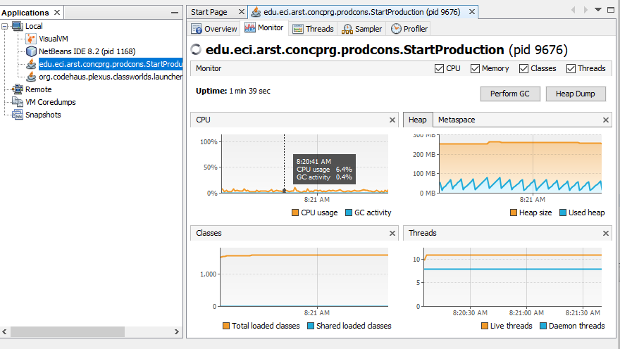
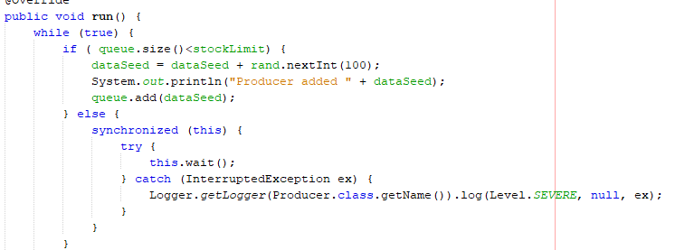

# immortalsARSW
---
# part 1 - before finishing class

* ***1.***   Check the operation of the program and run it. While this occurs, run jVisualVM and check the CPU consumption of the corresponding process. Why is this consumption? Which is the responsible class? 

  
  
  _This is because the class producer makes his execution every 5 seconds and it needs to calculate the new random and added in to the      queue while the consumer is asking faster than it takes the producer to make his execution._
  #
  

* ***2.***  Make the necessary adjustments so that the solution uses the CPU more efficiently, taking into account that - for now - production is slow and consumption is fast. Verify with JVisualVM that the CPU consumption is reduced.

* ***3.*** Make the producer now produce very fast, and the consumer consumes slow. Taking into account that the producer knows a Stock limit (how many elements he should have, at most in the queue), make that limit be respected. Review the API of the collection used as a queue to see how to ensure that this limit is not exceeded. Verify that, by setting a small limit for the 'stock', there is no high CPU consumption or errors.

 
  

---

 
 
